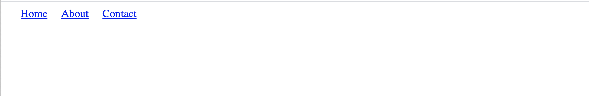

# dynamic-nav-practice
Dynamic navbar practice - playing with code.
Did not separate HTML, CSS, and JavaScript into separate files. Everything is in one file.

## Table of Contents
- [About](#about)
- [Process](#process)
- [Changes Made](#changes-made)
    - [Original Navbar](#original)
    - [My Navbar](#my-navbar)
- [Last Update](#last-update)

## About

I am learning how to create a navbar dynamically using JavaScript for Front End Web Development on Udacity. However, I am finding this to be challenging. I searched the web for additional examples, that might demonstrate this more clearly.

## Process

While watching this YouTube Video [Web Designing- lab javascript dynamic navbar](https://youtu.be/rSHJa1Mji_I), I recreated the code to see how they did it. I am calling this the "original" file.

Next, I created a copy of the original file, and am using this file to play with the code and see what works/doesn't work.

## Changes Made

CSS - made boxes laid out more clearly, and adjusted colors to see what is really going on.

JavaScript - Created a copy of the first navbar, and made a 2nd navbar to go underneath it.

### Original Navbar

(screenshot) This is how the navbar originally looks, based off the YouTube video example.

### My Navbar

(screenshot) This is how my navbar looks after updating the CSS and creating an extra copy of the navbar in JavaScript.

## Last Update

Created on: 4-14-2021
